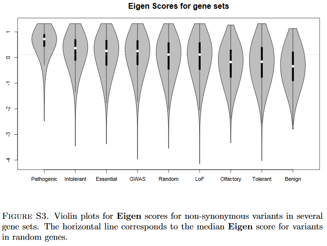

# Name

Eigen

# Version

v1.1

# Usefull for

Pathogenicity

#Type

Metascore

# Short description

Eigen is a spectral approach to the functional annotation of genetic variants in coding and noncoding regions. 

# Orientation and range

The higher the scores are the more damagin

Eigen-raw ranges from -5 to 1.5 in the original publication.

Eigen-raw_rankscore ranges from 0 to 1.

Eigen-phred ranges from 0 to 60.

Eigen-PC-raw (Eigen plus CADD score as input) ranges from -5 to 1.5 in the original publication.

Eigen-PC-raw_rankscore ranges from 0 to 1.

Eigen-PC-phred ranges from 0 to 60.

# Methodology

Here we introduce an unsupervised spectral approach (Eigen) for scoring variants which doesnot make use of labelled training data.  As such,  its performance is not sensitive to a particular labeling  of  the  training  dataset.   Instead,  the  approach  we  introduce  in  this  paper  is  based  ontraining using a large set of variants with a diverse set of annotations for each of these variants,but no label as to their functional status.

We assume that the variants can be partitioned into two distinct groups, functional and non-functional (although the partition is  unknown  to  us),  and  that  for  each  annotation  the  distribution  is  a  two-component  mixture, corresponding to the two groups.  The key assumption in theEigenapproach is that of block-wiseconditional independence between annotations given the true state of a variant (either functional ornon-functional).  This last assumption implies that any correlation between annotations in different blocks is due to differences in the annotation means between functional and non-functional variants,as we show in the Methods section.  Because of this, the correlation structure among the different functional annotations (Figure 1 and Supplemental Figure S1) can be used to determine how welleach annotation separates functional and non-functional variants (i.e.  the predictive accuracy ofeach annotation).  Subsequently we construct a weighted linear combination of annotations, basedon  these  estimated  accuracies.   We  illustrate  the  discriminatory  ability  of  the  proposed  meta-score using numerous examples of disease associated variants and putatively benign variants, bothcoding  and  noncoding,  from  the  literature.   In  addition  we  consider  a  related,  but  conceptually simpler meta-score ,Eigen-PC, which is based on the direct eigen decomposition of the annotation covariance matrix, and using the lead eigen vector to weight the individual annotations.  Note that due  to  difficulties  in  accurate  identification  of  insertion-deletions  (indels),  we  focus  our  analyses below on single nucleotide variants (SNVs), although one can calculate the meta-scores for indelsin a similar fashion.

# VCF description (VEP)

`##Eigen-PC-phred=(from dbNSFP) Eigen PC score in phred scale.`

`##Eigen-PC-raw=(from dbNSFP) Eigen PC score for genome-wide SNVs. A functional prediction score based on conservation, allele frequencies, deleteriousness prediction (for missense SNVs) and epigenomic signals (for synonymous and non-coding SNVs) using an unsupervised learning method (doi: 10.1038/ng.3477).`

`##Eigen-PC-raw_rankscore=(from dbNSFP) Eigen-PC-raw scores were ranked among all Eigen-PC-raw scores in dbNSFP. The rankscore is the ratio of the rank of the score over the total number of Eigen-PC-raw scores in dbNSFP.`

`##Eigen-phred=(from dbNSFP) Eigen score in phred scale.`

`##Eigen-raw=(from dbNSFP) Eigen score for coding SNVs. A functional prediction score based on conservation, allele frequencies, and deleteriousness prediction using an unsupervised learning method (doi: 10.1038/ng.3477).`

`##Eigen_coding_or_noncoding=(from dbNSFP) Whether Eigen-raw and Eigen-phred scores are based on coding model or noncoding model.`

# Long Description

Eigen makes use of a variety of functional annotations in both coding and noncoding regions (such as made available by the ENCODE and Roadmap Epigenomics projects), and combines them into one single measure of functional importance. Eigen is an unsupervised approach, and, unlike most existing methods, is not based on any labelled training data. Eigen produces estimates of predictive accuracy for each functional annotation score, and subsequently uses these estimates of accuracy to derive the aggregate functional score for variants of interest as a weighted linear combination of individual annotations.

# Exemple

# Source

[Site](http://www.columbia.edu/~ii2135/information_eigen.html)

[Publication](http://www.columbia.edu/~ii2135/Eigen_11_24.pdf)
