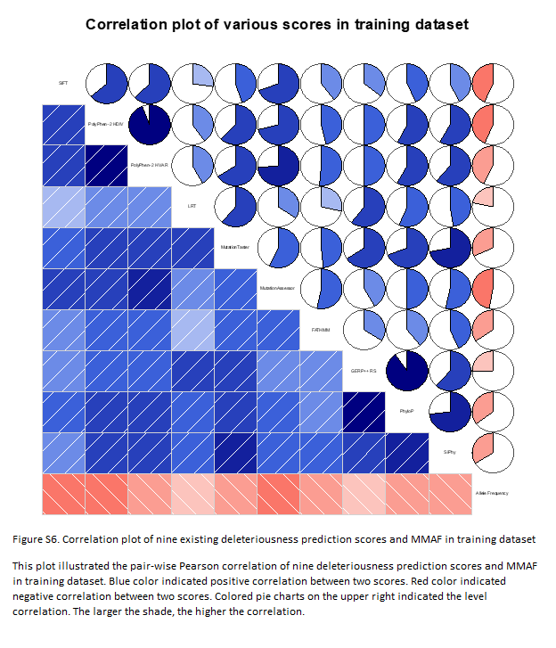
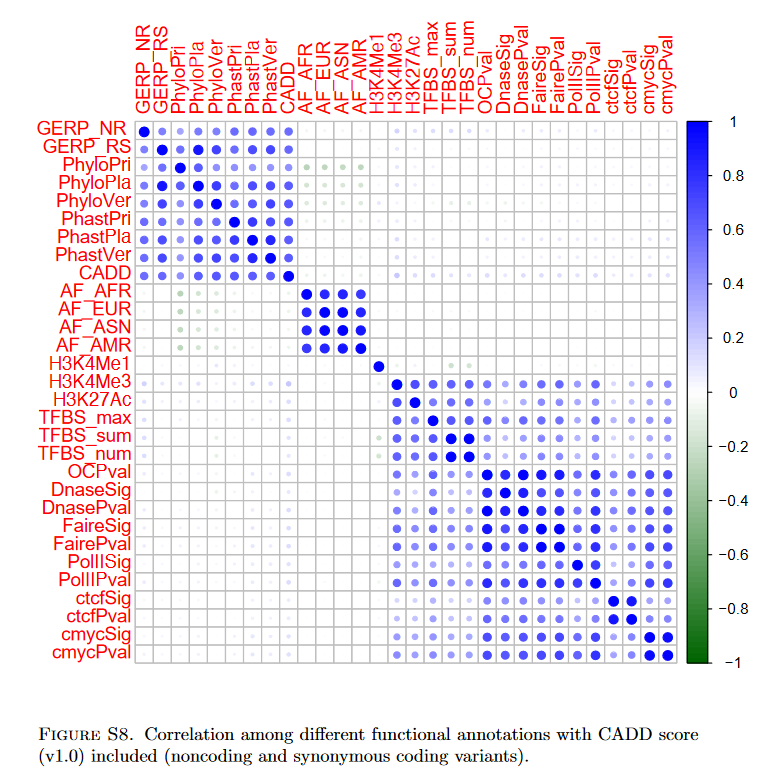

# scores

Description of scores used for genomic interpretation of variants.

List of scores:

Format:
* Name
* Version
* Type = {Score | Metascore}
* Category = {Conservation | Functionnal}
* Usefull for = {to define}
* Short description
* Orientation and range
* Methodology
* VCF description (VEP)
* Long Description
* Exemple
* Source

As some score are based on other scores the following array should ive a nice overview of their interactions:

| Metascores/scores | Number of annotations | [GERP](GERP.md) | [phastCons](phyloP_PhasCons.md) | [phyloP](phyloP_PhasCons.md) | Grantham | [SIFT](SIFT.md) | [PolyPhen](polyphen2.md) | [MutationTaster](MutationTaster.md) | [MutationAssessor](MutationAssessor.md) | [FATHMM](FATHMM.md) | [LRT](LRT.md) | SiPhy | 1000G AF | ESP AF | ClinVar | HGMD | gnomAD/BRAVO variant density | [VEST](VEST.md) | PROVEAN | MutPred | Gene Annotation? | bstatistic | mirSVR | targetScan | chromHMM | Encode expresion | Encode  nucleosome position | Encode  histone modification | Encode open chromatine | Encode DNAse hypersensitiv | Encode promoter-associated regulatory features | JASPAR | Segway | tOverlapMotifs | TFBS | mutationDensity | nearestMutation | dbscSNV | GC | CpG | NNSplice |
| - | - | - | - | - | - | - | - | - | - | - | - | - | - | - | - | - | - | - | - | - | - | - | - | - | - | - | - | - | - | - | - | - | - | - | - | - | - | - | - | - | - |
| [DANN](DANN.md) | 63 | X | X | X | X | X |  |  |  |  |  |  | X | X |  |  | X |  |  |  | X | X | X | X | X | X | X | X | X | X |  |  | X | X | X | X | X | X | X | X |  |
| [CADD](CADD.md) | 63 | X | X | X | X | X |  |  |  |  |  |  | X | X |  |  | X |  |  |  | X | X | X | X | X | X | X | X | X | X |  |  | X | X | X | X | X | X | X | X |  |
| [MetaLR/SVM](Meta.md) | 10 | X |  | X |  | X | X | X | X | X | X | X | X |  |  |  |  |  |  |  |  |  |  |  |  |  |  |  |  |  |  |  |  |  |  |  |  |  |  |  |  |
| [REVEL](REVEL.md) | 13 | X | X | X |  | X | X | X | X | X | X | X |  |  |  |  |  | X | X | X |  |  |  |  |  |  |  |  |  |  |  |  |  |  |  |  |  |  |  |  |  |
| MutationTaster2 |  |  | X | X |  |  |  |  |  |  |  |  | X |  | X | X |  |  |  |  |  |  |  |  |  |  |  | X |  | X | X | X |  |  |  |  |  |  |  |  | X |
| [VEST](VEST.md) | 2 |  |   |   |  |  |  |  |  |  |  |  |  | X |  | X |  |  |  |  |  |  |  |  |  |  |  |  |  |  |  |  |  |  |  |  |  |  |  |  |  |

An array resume of [Performance evaluation of pathogenicity-computation methods for missense variants](https://www.ncbi.nlm.nih.gov/pmc/articles/PMC6125674/)

| Methods | Type | Category | Core model | Damaging | Tolerable | Training data | Testing data | AUC clinvar benchmark | AUC TP53 benchmark | Version |
| - | - | - | - | - | - | - | - | - | - | - |
| FATHMM | Score | Functionnal | Hidden Markov models | ≤ 1.5 | > 1.5 | SNVs from HGMD (November 2011) and UniProt (November 2011) | SNVs from VariBench database (November 2011), SwissVar (February 2011) and four cancer-associated genes (BRCA1, MSH2, MLH1, and TP53) (Hicks et al. 2011) | 0.694 |	0.877 | Current version: FATHMM v2.3 |
| fitCons | Score | Functionnal | INSIGHT (Inference of Natural Selection from Interspersed Genomically coHerent elemenTs) | > 0.7 | < 0.7 | Genomes of 54 unrelated human individuals | three types of functional elements | 0.611 |	0.521 | Current version: V1.01 28-Aug-2014  |
| LRT | Score | Functionnal | Likelihood ratio test of codon neutrality | < 0.001 | > 0.001 | Coding sequences of 32 vertebrate species | three human genomes (Levy et al. 2007; Wang et al. 2008; Wheeler et al. 2008) | 0.789 |	0.731 | Last updated: November 20, 2009 |
| Mutation Assessor | Score | Functionnal | Combinatorial entropy formalism | > 1.9 | ≤ 1.9 | SNVs from COSMIC database ( release 49) | SNVs from UniProt (HUMSAVAR, release 2010_08), IARC TP53 database and COSMIC database  ( release 49) |  0.850 |	0.880 | Dec 31, 2015 Release3 |
| MutationTaster | Score | Functionnal | Naive Bayes classifier | > 0.5 | ≤ 0.5 | SNVs from dbSNP, OMIM, HGMD and the literature | SNVs from dbSNP, OMIM, HGMD and the literature | 0.610 |	0.568 | Apr 2014 Mutation Taster2 published, training SNVs from 1000 G and HGMD |
| PolyPhen2-HDIV | Score | Functionnal | Naive Bayes classifier | > 0.453 | < 0.453 | SNVs from UniRef100 (release 15.12 of 15-Dec-2009) and UniProtKB/Swiss-Prot (release 57.12 of 15-Dec-2009) | SNVs from UniProtKB/Swiss-Prot (release 57.12 of 15-Dec-2009) |  0.839 |	0.865 | Last updated: Mar 08, 2012; current version: PolyPhen-2 v2.2.2 (r394) Feb 23, 2012  |
| PolyPhen2-HVAR | Score | Functionnal | Naive Bayes classifier | > 0.447 | < 0.447 | SNVs from UniRef100 (release 15.12 of 15-Dec-2009) and UniProtKB/Swiss-Prot (release 57.12 of 15-Dec-2009) | SNVs from UniProtKB/Swiss-Prot (release 57.12 of 15-Dec-2009) |  0.865 |	0.883 | Last updated: Mar 08, 2012; current version: PolyPhen-2 v2.2.2 (r394) Feb 23, 2012 |
| PROVEAN | Score | Functionnal | Delta alignment score | ≤ 2.5 | > -2.5 | SNVs from UniProt/HUMSAVAR (Release 2011_09) | SNVs from UniProt (Release 2011_09) and experimental datasets from mutagenesis experiments, previously carried out for the E.coli LacI protein (Markiewicz et al. 1994) and the human, tumor suppressor TP53 protein |  0.858 |	0.898 | Last updated: Jan 30, 2015 current version: v1.1.5 May 7, 2014 |
| SIFT | Score | Functionnal | Position-specific scoring matrix | ≤ 0.05 | > 0.05 | 1,750 deleterious and 2,254 tolerant nsSNVs of E. coli LacI gene | 4004 substitutions from LacI (Markiewiczet al. 1994; Suckow et al. 1996), 336 substitutions from HIV-1 protease (Loeb et al. 1989), and 2015 substitutions from bacteriophage T4 lysozyme (Rennell et al. 1991) | 0.860 |	0.879 | Last updated: Aug 2011; current version: SIFT v. 1.03 |
| VEST3 | Score | Functionnal | Random Forest | > 0.5 | < 0.5 | SNVs from HGMD (2012v2) and the exome  sequencing project (ESP6500 accessed 07/2012) | SNVs from HGMD (2012v2) and the exome  sequencing project (ESP6500 accessed 07/2012) |  0.929 |	0.912 | most recent version: VEST-4，  Positive class expanded and updated to HGMD (2017.1)，Neutral class changed to ExAC Release 1 (2/2017)  |
| GERP++ | Score | Conservation | Maximum likelihood evolutionary rate estimation | > 2 | < 2 | Genomes of 34 mammals | Genomes of 33 other mammalian | 0.739 |	0.732 | not updated |
| phastCons | Score | Conservation | Two-state phylogenetic hidden Markov Model | > 0.999 | ≤ 0.999 | Genomes of seven vertebrates, Genomes of 20 mammals | five vertebrate genomes, four insect genomes, two Caenorhabditis genomes, and seven Saccharomyces genomes. | 0.767 |	0.751 | Current version: PHAST 1.4 October, 2016,  Genomes of 100 vertebrates |
| PhyloP | Score | Conservation | Distributions of the number of substitutions based on a phylogenetic hidden Markov model | > 2 | < 2 | Genomes of seven vertebrates, Genomes of 20 mammals | 100,000 fourfold degenerate sites extracted from alignments of up to 19 species for the 44 ENCODE regions (Margulies et al. 2007) | 0.848 | 0.802 | Current version: PHAST 1.4 October, 2016,  Genomes of 100 vertebrates |
| SiPhy | Score | Conservation | Inferring nucleotide substitution pattern | > 12 | < 12 | Genomes of 29 mammals | ENCODE regions (Birney et al., 2007) | 0.776 |	0.731 | Current version: 0.5 May 1, 2009 |
| CADD | Metascore | Both | Linear kernel support vector machine | > 20 | ≤ 20 | 16,627,775 high-frequency human-derived alleles and 49,407,057 “simulated” variants | SNVs from MLL2 gene (Makrythanasis et al), ESP, HBB gene and ClinVar database (release date June 16 2012), somatic mutations from p53, variants from two enhancers and one promoter  |  0.877 |	0.841 | Current version: Webserver v1.3 CADD v1.1: Dec 2, 2014,  a slightly extended and updated annotation set |
| DANN | Metascore | Both | Deep neural network | > 0.99 | < 0.99 | 16,627,775 high-frequency human-derived alleles and 49,407,057 “simulated” variants | 3,325,555 “observed” variants and “simulated” variants | 0.807 |	0.752 | not updated |
| Eigen | Metascore | Both | Hierarchical model | > 0 | < 0 | Variants from dbNSFP v2.7 | variants from ClinVar database, MLL2, CFTR, BRCA1 and BRCA2 genes for Mendelian diseases, de novo mutations associated with ASD, EPI, ID and SCZ, GWAS and eQTL SNPs, noncoding cancer mutations from the COSMIC database |  0.871 |	0.849 | Current version: Eigen and Eigen-PC v1.1 |
| FATHMM-MKL | Metascore | Both | Multiple kernel learning | > 0.5 | ≤ 0.5 | SNVs from HGMD (release 2013.4) and 1000G | SNVs from HGMD (release 2013.4), 1000G and ClinVar | 0.822 |	0.804 | Current version: FATHMM v2.3 |
| GenoCanyon | Metascore | Both | Statistical Model | > 0.999 | ≤ 0.999 | ENCODE project | variants from ClinVar in June 2014 | 0.683 |	0.679 | Not updated |
| M-CAP | Metascore | Both | Gradient boosting trees | > 0.025 | ≤ 0.025 | SNVs from HGMD Pro version 2015.2 and ExAC version 0.3 (Jan 13, 2015 release) | rare SNVs from HGMD Pro version 2015.2, 1000G, patient exomes and Mendelian mutations associated with BRCA1,  BRCA2, CFTR, MLL2 | 0.814 |	0.803 | Not updated |
| MetaLR | Metascore | Both | logistic regression | > 0.5 | ≤ 0.5 | SNVs from UniProt database | SNVs from 57 publications (after 1 January 2011) from the journal Nature Genetics, CHARGE sequencing project and VariBench dataset II | 0.874 |	0.898 | Not updated |
| MetaSVM | Metascore | Both | support vector machine | > 0 | ≤ 0 | SNVs from Uniprot database | SNVs from 57 publications (after 1 January 2011) for the journal Nature Genetics, CHARGE sequencing project and VariBench dataset II | 0.858 |	0.578 | Not updated |
| REVEL | Metascore | Both | Random Forest | > 0.4 | < 0.4 | SNVs from HGMD version 2015.2, Missense exome sequencing variants from ESP、ARIC、KGP | SNVs from SwissVar disease (release 2015_10), ClinVar database and variants from ESP、ARIC、KGP |  0.920 |	0.901 | Not updated |

[Source S10](https://www.ncbi.nlm.nih.gov/pmc/articles/PMC6125674/)

[Source S10](https://www.ncbi.nlm.nih.gov/pmc/articles/PMC6125674/)

Some scores are more or less correlated as we can see on :

* the Meta publication dataset :  

* the Eigen publication dataset :  

